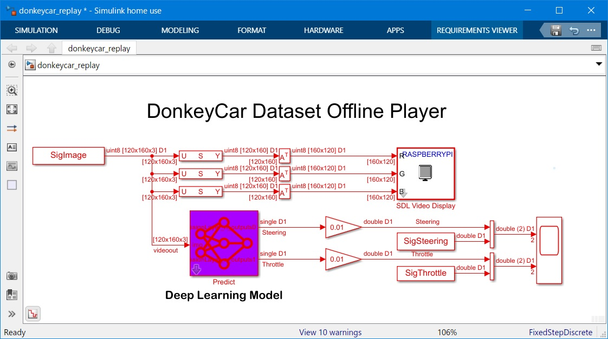
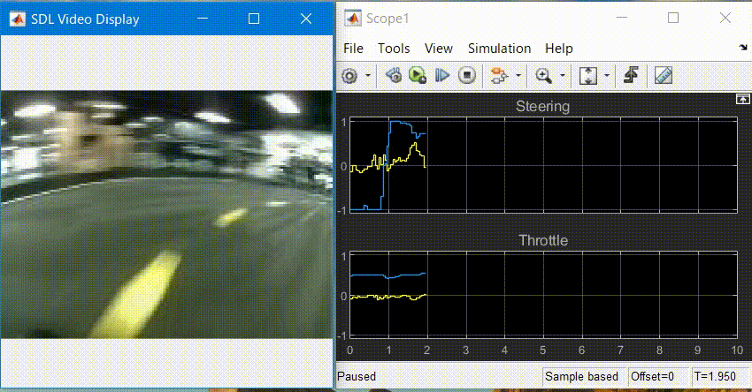

[](https://jp.mathworks.com/matlabcentral/fileexchange/112655-donkeycar-s-dataset-replay-using-matlab-simulink)
# DonkeyCar's Dataset Replay using MATLAB/Simulink

Example of DoneyCar's Dataset Replay and Prediction by deep learning model

## MATLAB command to download and open the demo (MATLAB live script)
```
mkdir('./donkeycar_demo');
cd('./donkeycar_demo');
websave('Replay_Donkeycar_Simulink.mlx','https://github.com/covao/Replay_DonkeyCar_Simulink/raw/main/Replay_Donkeycar_Simulink.mlx');
websave('donkeycar_replay.mdl','https://github.com/covao/Replay_DonkeyCar_Simulink/raw/main/donkeycar_replay.mdl');
open('Replay_Donkeycar_Simulink.mlx');

```
MATLAB live script file [Replay_Donkeycar_Simulink.mlx](https://github.com/covao/Replay_DonkeyCar_Simulink/blob/main/Replay_Donkeycar_Simulink.mlx)  

  

  
